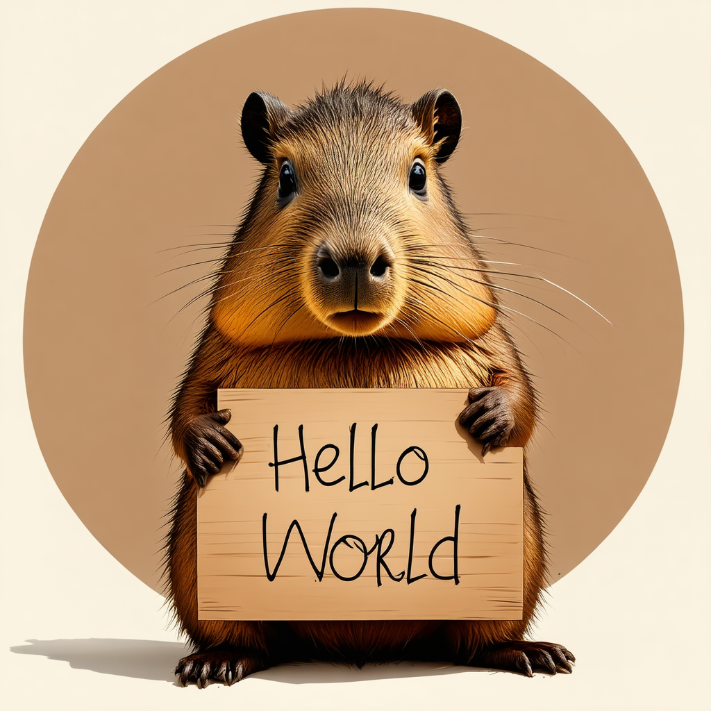

# dive-into-stable-diffusion-v3-5


[简体中文](./README_zh.md)

[Stable Diffusion v3.5原理介绍](https://blog.csdn.net/sinat_16020825/article/details/146406963)

## Intro

This is the training code for fine-tune Stable Diffusion v3.5. The script is adapted from [the diffusers library](https://github.com/huggingface/diffusers/).


<p align="center">
    
</p>


This project includes the following components:

- Full fine-tuning of the SDv3.5 model
- Fine-tuning the SDv3.5 model using LoRA
- Fine-tuning the SDv3.5 model with DreamBooth combined with LoRA
- RLHF-based fine-tuning of the SDv3.5 model using DDPO with an aesthetic scorer
- RLHF-based fine-tuning of the SDv3.5 model using GRPO with an aesthetic scorer
- DPO-based fine-tuning of the SDv1.5 model
- RLHF-based fine-tuning of the SDv1.5 model using ReFL with a text-image matching scorer

Let's dive into Stable Diffusion v3.5!

## Setup

`pip install -r requirements.txt`

## Structure

- `datas/` Path to Dataset (from the HuggingFace hub) containing the training data of instance images or prompts
- `models/` Path to pretrained model downloaded from huggingface.co/models
- `outputs/` The output directory where the model predictions and checkpoints will be written
- `scripts/` Main script for running SDv3.5 training
- `src/` Main pipeline and trainer
- `demo.py / demo.sh` is examples of running SDv3.5 inference
- `requirements.txt / setup.py` Basic pip requirements
- `train*.py` Main script.


## Download models and dataset from HuggingFace or GitHub
```bash
models
|-- aesthetics-predictor-v1-vit-large-patch14
|-- clip-vit-large-patch14
|-- improved-aesthetic-predictor
`-- stable-diffusion-3.5-medium
```

Download improved-aesthetic-predictor from: [improved-aesthetic-predictor](https://github.com/christophschuhmann/improved-aesthetic-predictor)

```bash
datas
|-- dogs
`-- pokemon
```

## Running the training

- Full fine-tuning of the SDv3.5 model

```bash
bash scripts/train_full_finetuning_sd3.sh
```

- Fine-tuning the SDv3.5 model using LoRA
```bash
bash scripts/train_text_to_image_lora_sd3.sh
```

- Fine-tuning the SDv3.5 model with DreamBooth combined with LoRA
```bash
bash scripts/train_dreambooth_lora_sd3.sh
```

- RLHF-based fine-tuning of the SDv3.5 model using DDPO with an aesthetic scorer
```bash
bash scripts/train_aesthetic_ddpo_sd3.sh
```

- RLHF-based fine-tuning of the SDv3.5 model using GRPO with an aesthetic scorer
```bash
# Note: This part of the code may have issues and needs further refinement.
bash scripts/train_aesthetic_rlhf_grpo_lora_sd3.sh
```

- DPO-based fine-tuning of the SDv1.5 model
```bash
bash scripts/train_dpo_sd_v1_5.sh
```

- RLHF-based fine-tuning of the SDv3.5 model using ReFL with a text-image matching scorer
```bash
bash scripts/train_refl_v1_5.sh
```


## Important Args

### General

- `--pretrained_model_name_or_path` what model to train/initalize from
- `--output_dir` where to save/log to
- `--seed` training seed (not set by default)

### Optimizers/learning rates

- `--max_train_steps` How many train steps to take
- `--gradient_accumulation_steps`
- `--train_batch_size` see above notes in script for actual BS
- `--checkpointing_steps` how often to save model
  
- `--gradient_checkpointing` turned on automatically for SDXL


- `--learning_rate`
- `--scale_lr` Found this to be very helpful but isn't default in code
- `--lr_scheduler` Type of LR warmup/decay. Default is linear warmup to constant
- `--lr_warmup_steps` number of scheduler warmup steps

### Data
- `--dataset_name` Path to Dataset (from the HuggingFace hub) containing the training data of instance images or prompts
- `--cache_dir` where dataset is cached locally **(users will want to change this to fit their file system)**
- `--resolution` defaults to 512 for non-SDXL, 1024 for SDXL.
- `--random_crop` and `--no_hflip` changes data aug
- `--dataloader_num_workers` number of total dataloader workers


